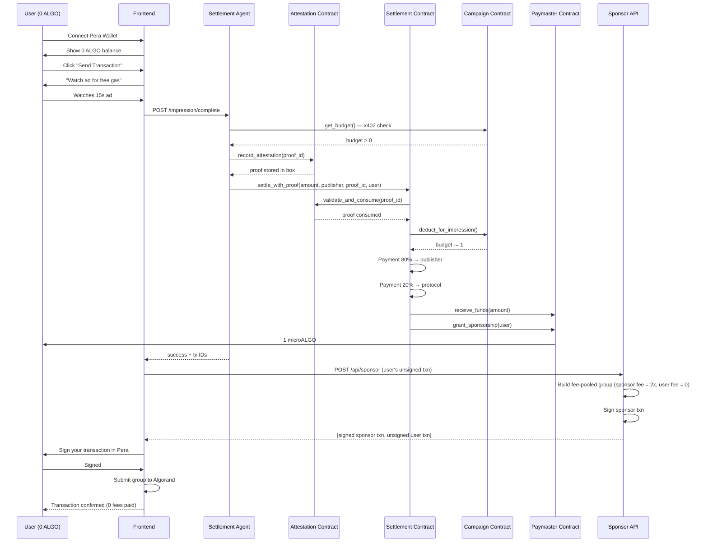
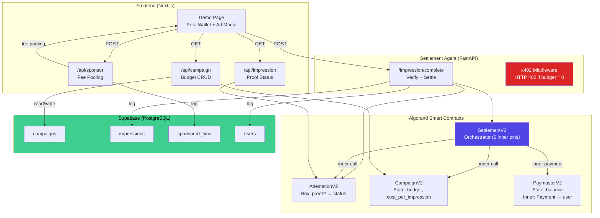
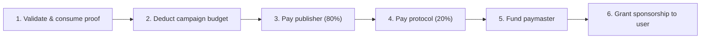

# GhostGas

**Ad-sponsored gas abstraction for Algorand.** Users with 0 ALGO watch a 15-second ad, an autonomous agent settles the impression on-chain, and a sponsor covers their transaction fees — so the user pays nothing.

## How It Works



## Architecture



## Contract System

Four AlgoPy (ARC4) contracts on Algorand TestNet:

| Contract | Role | Key State |
|---|---|---|
| **AttestationV2** | Proof storage & verification | Box: `proof:{id}` → `1` |
| **CampaignV2** | Advertiser budget tracking | `budget`, `cost_per_impression` |
| **PaymasterV2** | ALGO fee sponsorship | `balance` (tracks microALGO) |
| **SettlementV2** | Orchestrator — ties everything together | Links to other 3 contracts |

### Settlement Flow (settle_with_proof)

The Settlement contract executes 6 inner transactions atomically:



### Fee Sponsorship (Sponsor API)

Uses Algorand's **fee pooling** — no smart contract needed for fee coverage:

```
Group of 2 transactions:
  Txn 0: Sponsor → Sponsor (0 ALGO, fee = 2000 μALGO)  ← covers both
  Txn 1: User → User (0 ALGO, fee = 0)                  ← free ride
```

## Deployed Contracts (TestNet)

### V2 (Cross-Contract Enabled — Production Architecture)

```
V2_CAMPAIGN_APP_ID=758809461
V2_SETTLEMENT_APP_ID=758809462
V2_PAYMASTER_APP_ID=758809463
V2_ATTESTATION_APP_ID=758809473
```

### V1 (Simple — No Cross-Contract Calls)

```
CAMPAIGN_APP_ID=758808364
SETTLEMENT_APP_ID=758808374
PAYMASTER_APP_ID=758808375
ATTESTATION_APP_ID=758808376
```

## Project Structure

```
├── contracts/                    # AlgoPy smart contracts
│   ├── attestation_v2.py         #   Proof box storage
│   ├── campaign_v2.py            #   Budget management
│   ├── paymaster_v2.py           #   ALGO sponsorship payments
│   └── settlement_v2.py          #   Orchestrator (inner txn chain)
├── scripts/
│   ├── deploy.py                 # Deploy all 4 contracts
│   └── generate_clients.py       # Generate typed Python clients
├── fe+be/algo/                   # Next.js frontend + API
│   ├── app/
│   │   ├── page.tsx              #   Demo: wallet, ad modal, dashboard
│   │   └── api/
│   │       ├── sponsor/route.ts  #   Fee-pooled tx builder
│   │       ├── campaign/route.ts #   Campaign budget read/write
│   │       ├── impression/route.ts # Proof status reader
│   │       └── stats/route.ts    #   Dashboard stats from Supabase
│   └── lib/
│       ├── algod.ts              #   Algod client helpers
│       ├── contracts.ts          #   TypeScript ABI wrappers (all methods)
│       └── supabase.ts           #   Supabase client (lazy, graceful fallback)
├── agent/
│   ├── agent.py                  # FastAPI settlement agent + Supabase logging
│   └── requirements.txt
├── supabase/
│   └── migrations/
│       └── 001_initial_schema.sql # DB schema (campaigns, impressions, users, sponsored_txns)
├── CONTRACTS.md                  # Full contract documentation
└── artifacts/                    # Compiled TEAL + ARC56 specs
```

## Tech Stack

| Layer | Tech |
|---|---|
| Blockchain | Algorand TestNet |
| Contracts | AlgoPy (ARC4) |
| Frontend | Next.js 16, Tailwind, Pera Wallet Connect |
| Backend APIs | Next.js Route Handlers |
| Settlement Agent | Python FastAPI |
| Database | Supabase (PostgreSQL) |
| SDK | algosdk v3 (TS), py-algorand-sdk (Python) |
| Tooling | AlgoKit, Poetry |

## Getting Started

### 1. Install Dependencies

```bash
# Smart contracts (Python)
poetry install

# Frontend (Node)
cd fe+be/algo && pnpm install

# Agent (Python)
cd agent && pip install -r requirements.txt
```

### 2. Set Environment Variables

Create `fe+be/algo/.env.local`:

```env
NEXT_PUBLIC_ALGOD_SERVER=https://testnet-api.algonode.cloud
NEXT_PUBLIC_INDEXER_SERVER=https://testnet-idx.algonode.cloud
NEXT_PUBLIC_AGENT_URL=http://localhost:8000
NEXT_PUBLIC_SUPABASE_URL=https://pplfvsxxyjnafppllopd.supabase.co
NEXT_PUBLIC_SUPABASE_ANON_KEY=<your supabase anon key>
SUPABASE_SERVICE_ROLE_KEY=<your supabase service role key>
SPONSOR_MNEMONIC=<25-word mnemonic for fee sponsor account>
CAMPAIGN_APP_ID=758809461
ATTESTATION_APP_ID=758809473
PRIVATE_KEY=<admin private key>
```

Create `agent/.env` (or export):

```env
ALGOD_SERVER=https://testnet-api.algonode.cloud
PRIVATE_KEY=<admin private key>
CAMPAIGN_APP_ID=758809461
SETTLEMENT_APP_ID=758809462
ATTESTATION_APP_ID=758809473
PAYMASTER_APP_ID=758809463
SUPABASE_URL=https://pplfvsxxyjnafppllopd.supabase.co
SUPABASE_SERVICE_ROLE_KEY=<your supabase service role key>
```

### 2b. Set Up Supabase Database

Run the migration in your Supabase SQL editor (or with the Supabase CLI):

```bash
# Option 1: Supabase CLI
supabase db push

# Option 2: Copy-paste supabase/migrations/001_initial_schema.sql into the SQL editor
```

This creates 4 tables: `campaigns`, `impressions`, `sponsored_txns`, `users` with RLS policies.

### 3. Run

```bash
# Terminal 1 — Frontend
cd fe+be/algo && pnpm dev

# Terminal 2 — Settlement Agent
cd agent && uvicorn agent:app --reload --port 8000
```

### 4. Demo Flow

1. Open `http://localhost:3000`
2. Connect Pera Wallet (use a testnet account with 0 ALGO)
3. Click "Send Transaction"
4. Watch the 15-second ad
5. Click "Claim Free Gas"
6. Sign the transaction in Pera
7. Transaction confirms — you paid 0 fees

## Compile & Deploy Contracts

```bash
# Compile AlgoPy → TEAL
algokit compile python contracts

# Generate typed clients
python scripts/generate_clients.py

# Deploy to testnet
python scripts/deploy.py
```

## Network

- **Network:** Algorand TestNet
- **Algod RPC:** `https://testnet-api.algonode.cloud`
- **Indexer:** `https://testnet-idx.algonode.cloud`
- **Explorer:** `https://testnet.explorer.perawallet.app`
