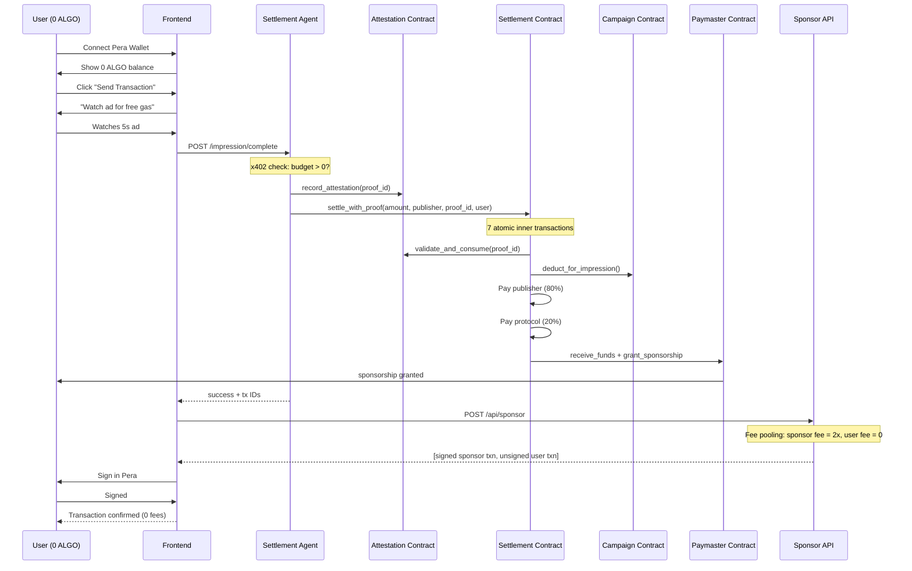
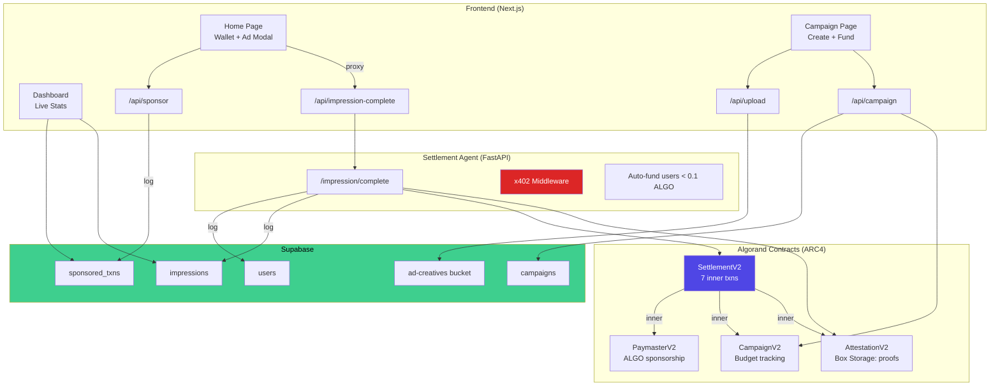
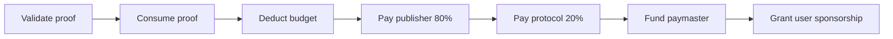

<p align="center">
  
  
  
  
  
</p>

# GhostGas

**Zero-fee transactions on Algorand, powered by ads.**

Users with 0 ALGO connect their wallet, watch a 5-second ad, and transact — without paying a single microALGO in fees. An autonomous agent settles the ad impression on-chain, and a sponsor covers the transaction fee via Algorand's native fee pooling. The advertiser pays, the publisher earns 80%, the protocol takes 20%, and the user pays nothing.

> Built for the Algorand hackathon. Live on TestNet with real on-chain transactions.

---

## The Problem

New users on Algorand can't do anything without ALGO for gas fees. Every other chain has this problem too — but Algorand has a unique feature (fee pooling) that makes it solvable at the protocol level.

## The Solution

GhostGas turns ad impressions into gas sponsorship:

```
User has 0 ALGO → watches 5s ad → agent settles on-chain → sponsor covers fee → user transacts free
```

## Demo

| Step | What happens |
|------|-------------|
| 1 | User connects Pera Wallet (0 ALGO balance) |
| 2 | Clicks "Send Transaction" — gets blocked by insufficient fees |
| 3 | Watches a 5-second sponsored ad |
| 4 | Agent records proof on-chain, settles impression atomically |
| 5 | Sponsor API wraps the user's txn with fee pooling (fee = 0 for user) |
| 6 | User signs in Pera, transaction confirms on Algorand TestNet |
| 7 | User paid **0 ALGO** in fees |

---

## How It Works



---

## Architecture



---

## Smart Contracts

Four AlgoPy (ARC4) contracts deployed on Algorand TestNet:

| Contract | App ID | Role |
|----------|--------|------|
| **CampaignV2** | `758809461` | Tracks advertiser budget (impression counter) |
| **SettlementV2** | `758809462` | Orchestrator — 7 atomic inner txns per impression |
| **PaymasterV2** | `758809463` | Sends ALGO sponsorship to users |
| **AttestationV2** | `758809473` | Box storage for proof-of-impression |

### Settlement Pipeline

When `settle_with_proof` is called, the Settlement contract atomically executes:



All 7 inner transactions succeed or all fail. No partial state.

### Fee Pooling

Algorand's native fee pooling — one transaction overpays fees to cover another:

```
Atomic Group:
  Txn 0: Sponsor → Sponsor  (0 ALGO, fee = 2000 μALGO)  ← pays for both
  Txn 1: User → User        (0 ALGO, fee = 0)             ← free
```

No relayer. No paymaster contract for fees. Just native Algorand.

---

## SDK

The real product — any Algorand dApp drops in `@ghostgas/sdk` and their users never pay fees:

```ts
import { GhostGas } from "@ghostgas/sdk";

const ghost = new GhostGas({
  campaignAppId: 758809461,
  publisherAddress: "YOUR_DAPP_ADDRESS...", // you earn 80%
});

// Check if user needs gas
if (await ghost.needsSponsorship(userAddress)) {
  showAdModal(); // your UI
}

// One call does everything: settle → sponsor → sign → confirm
const txn = await ghost.buildTestTransaction(userAddress);
const result = await ghost.sponsoredSend(userAddress, txn, wallet);
// result.txId — confirmed on-chain, user paid 0 fees
```

### Campaign Management

```ts
import { GhostGasAdmin } from "@ghostgas/sdk";

const admin = new GhostGasAdmin({
  campaignAppId: 758809461,
  mnemonic: "your mnemonic...",
  publisherAddress: "",
});

await admin.depositBudget(100);           // fund 100 impressions
const info = await admin.getCampaignInfo(); // read on-chain state
const status = await admin.checkImpression(appId, proofId); // verify proof
```

See [`packages/sdk/`](packages/sdk/) for full docs and examples.

---

## Project Structure

```
ghostgas/
├── contracts/                          # AlgoPy smart contracts
│   ├── attestation_v2.py              #   Proof box storage
│   ├── campaign_v2.py                 #   Budget management
│   ├── paymaster_v2.py                #   ALGO sponsorship payments
│   └── settlement_v2.py               #   Orchestrator (7 inner txns)
│
├── fe+be/algo/                         # Next.js 16 app
│   ├── app/
│   │   ├── page.tsx                   #   Home: wallet + ad + sponsor flow
│   │   ├── campaign/page.tsx          #   Campaign: create, fund, upload ad
│   │   ├── dashboard/page.tsx         #   Dashboard: live protocol stats
│   │   ├── components/
│   │   │   ├── WalletProvider.tsx      #   Pera Wallet context
│   │   │   ├── Navbar.tsx             #   Navigation
│   │   │   └── AdModal.tsx            #   Ad player with countdown
│   │   └── api/
│   │       ├── sponsor/route.ts       #   Fee-pooled tx builder
│   │       ├── campaign/route.ts      #   Campaign CRUD (on-chain + Supabase)
│   │       ├── impression-complete/   #   Agent proxy (no CORS)
│   │       ├── impression/route.ts    #   Proof status from box storage
│   │       ├── stats/route.ts         #   Aggregate stats from Supabase
│   │       └── upload/route.ts        #   Ad creative upload (Supabase Storage)
│   └── lib/
│       ├── algod.ts                   #   Algod client + account helpers
│       ├── contracts.ts               #   ABI wrappers for all contract methods
│       └── supabase.ts                #   Supabase client (lazy init)
│
├── agent/                              # Python settlement agent
│   ├── agent.py                       #   FastAPI: settle, x402, auto-fund
│   └── requirements.txt
│
├── packages/sdk/                       # @ghostgas/sdk
│   ├── src/
│   │   ├── ghostgas.ts                #   GhostGas class (user-facing)
│   │   ├── admin.ts                   #   GhostGasAdmin (campaign mgmt)
│   │   ├── abi.ts                     #   Contract ABI definitions
│   │   └── types.ts                   #   TypeScript interfaces
│   └── examples/
│       ├── create-campaign.ts         #   Fund a campaign
│       ├── check-impression.ts        #   Verify proof on-chain
│       └── integrate-dapp.ts          #   5-line dApp integration
│
├── supabase/migrations/                # Database schema
│   ├── 001_initial_schema.sql         #   Tables + RLS policies
│   └── 002_storage_bucket.sql         #   Ad creative storage
│
├── CONTRACTS.md                        # Full contract documentation
└── scripts/
    ├── deploy.py                      # Deploy contracts to TestNet
    └── generate_clients.py            # Generate typed Python clients
```

---

## Tech Stack

| Layer | Technology |
|-------|-----------|
| Blockchain | Algorand TestNet |
| Smart Contracts | AlgoPy (ARC4) with cross-contract calls |
| Frontend | Next.js 16, Tailwind CSS, Pera Wallet Connect |
| Settlement Agent | Python FastAPI (autonomous, no human trigger) |
| Database | Supabase (PostgreSQL + Storage) |
| SDK | TypeScript, algosdk v3 |
| Tooling | AlgoKit, Poetry, pnpm |

---

## Quick Start

### 1. Clone & Install

```bash
git clone https://github.com/Shrysxs/algorand-protocol.git
cd algorand-protocol

# Contracts
poetry install

# Frontend
cd fe+be/algo && pnpm install

# Agent
cd ../../agent && pip3 install -r requirements.txt
```

### 2. Configure

Create `fe+be/algo/.env.local`:
```env
NEXT_PUBLIC_ALGOD_SERVER=https://testnet-api.algonode.cloud
NEXT_PUBLIC_INDEXER_SERVER=https://testnet-idx.algonode.cloud
NEXT_PUBLIC_AGENT_URL=http://localhost:8000
NEXT_PUBLIC_SUPABASE_URL=<your-supabase-url>
NEXT_PUBLIC_SUPABASE_ANON_KEY=<your-anon-key>
SUPABASE_SERVICE_ROLE_KEY=<your-service-key>
SPONSOR_MNEMONIC=<25-word mnemonic>
PRIVATE_KEY=<base64 admin key>
CAMPAIGN_APP_ID=758809461
SETTLEMENT_APP_ID=758809462
PAYMASTER_APP_ID=758809463
ATTESTATION_APP_ID=758809473
```

Create `agent/.env`:
```env
ALGOD_SERVER=https://testnet-api.algonode.cloud
PRIVATE_KEY=<base64 admin key>
CAMPAIGN_APP_ID=758809461
SETTLEMENT_APP_ID=758809462
ATTESTATION_APP_ID=758809473
PAYMASTER_APP_ID=758809463
SUPABASE_URL=<your-supabase-url>
SUPABASE_SERVICE_ROLE_KEY=<your-service-key>
```

### 3. Set Up Database

Run both SQL files in Supabase SQL Editor:
- `supabase/migrations/001_initial_schema.sql`
- `supabase/migrations/002_storage_bucket.sql`

### 4. Run

```bash
# Terminal 1 — Frontend
cd fe+be/algo && pnpm dev

# Terminal 2 — Agent
cd agent && python3 -m uvicorn agent:app --reload --port 8000
```

### 5. Test the Flow

1. Open `http://localhost:3000`
2. Connect Pera Wallet (testnet account)
3. Go to `/campaign` → create campaign, deposit budget, upload ad creative
4. Go home → click "Send Transaction"
5. Watch the ad (5s) → click "Claim Free Gas"
6. Sign in Pera → transaction confirms, **0 fees paid**
7. Check `/dashboard` for live stats

---

## x402 Protocol

When campaign budget reaches 0, the agent returns:

```http
HTTP/1.1 402 Payment Required
Content-Type: application/json

{"error": "Campaign budget exhausted", "payment_required": true}
```

No more ads are served. Advertiser must deposit more budget to resume.

---

## Revenue Model

| Party | Share | Source |
|-------|-------|--------|
| Publisher (dApp) | 80% | Settlement contract inner payment |
| Protocol (GhostGas) | 20% | Settlement contract inner payment |
| User | 0% | Pays nothing |

Revenue flows are enforced on-chain in the Settlement contract. `publisher_bps = 8000` (80/20 split, hardcoded at deployment).

---

## Compile & Deploy Contracts

```bash
# Compile AlgoPy → TEAL
algokit compile python contracts

# Generate typed clients
python scripts/generate_clients.py

# Deploy to TestNet
python scripts/deploy.py
```

---

## Network

| | |
|---|---|
| **Network** | Algorand TestNet |
| **Algod** | `https://testnet-api.algonode.cloud` |
| **Indexer** | `https://testnet-idx.algonode.cloud` |
| **Explorer** | `https://testnet.explorer.perawallet.app` |

---

<p align="center">
  <sub>Built at Algorand Hackathon</sub>
</p>
